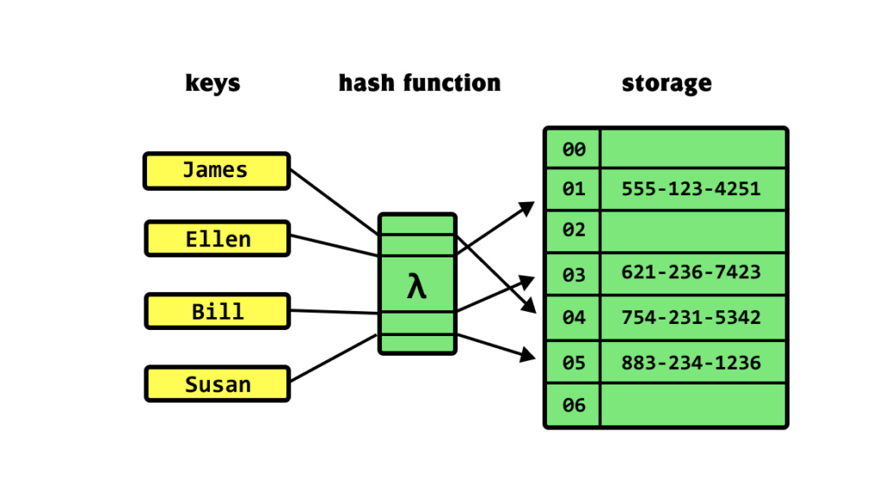
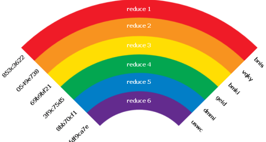

# Client_side_Advanced
Ethical Hacking : Users password cracking

Password cracking methods
Password storage
Rainbow tables
Windows password
Linux password

# Methods

* The first will be to guess it.
* Dictionary
* Brute force
* Hybrid

# Password storage

### passwords are stored encrypted

## Hashing
`Hashing` is the process of assigning a numeric value to an alphanumeric string by first converting it into another numeric value and storing it in an indexed table to make data retrieval faster and/or masking the data for encryption, performed by a hash function.

## Rainbow table
A `rainbow table` is in cryptanalysis, a data structure created in 2003 by Philippe Oechslin of EPFL1 to find a password from its fingerprint. It is an improvement of the time-memory tradeoffs proposed by Martin Hellman in the 1980.

### Structure of a rainbow table

Rainbow tables are composed of hash chains. This procedure is based on a method introduced by Martin Hellman. Based on a certain number of possible passwords, which serve as the starting point for the hash chains, the chains are hashed and the resulting hash value is "reduced" into a form that meets the password criteria and can then be hashed again . It is important here that the reduction functions that perform the reduction are not an inverse of the hash procedure, because such an inverse function does not exist. The reduction turns the hash, which is much larger than the original password, i.e. much more complex, into a value that meets the password strength criteria.

`Example`: The example hash value of the "password" is hunter22

20d2fe5e369db54ec70906 39a9dc30ec4d6086049362 39d39e2de07fda09eb0b

The reduction of this could be to use only the first 8 characters of the hash as the next password in the chain. These would then be "20d2fe5e" and can be hashed again as the next step.

A hash chain consists of "alternating" possible passwords and their corresponding hash values. On its own, however, this method does not offer any advantage over the theoretical use of a simple hash table, because if the hash chains are used to an extent that covers all possible passwords of the corresponding complexity and then these chains are stored in a table, the required storage space is at least as large as that of a simple hash table. Therefore, only the starting point, i.e. the first password and the last "password", i.e. a last reduction of the last created hash value of a chain, is stored in a table. The table thus consists of a corresponding number of start and end points of hash chains.

If you now have a hash value, you can use the reduction function to test whether the hash value is part of one of the created hash chains. To do this, the reduction function is applied to the hash value. If the result of the function is one of the end points of the chain, then you have found the hash chain that contains the password for the existing hash value. In the most favorable case just described, this would be the penultimate password in the chain, which led to the last hash value in the chain. As a rule, however, you will not find a password directly in the first reduction step. Therefore, the reduction function(s) and the hash function must be repeatedly applied to the originally captured hash value. One can imagine this by trying to put the hash chain containing the captured hash value back together again, starting at the end. The moment the partially constructed hash chain has an endpoint stored in the rainbow table, you have found the complete hash chain and can extract the password in plain text.

